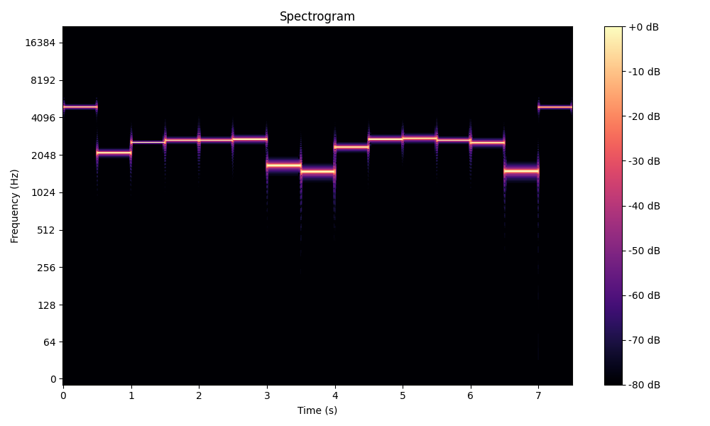

# Bytes Transfer Over Directed Sound Waves

## Overview

This project demonstrates a method for encoding and decoding byte data into audio frequencies and back, allowing for data transfer over sound waves. The system comprises an encoder to convert byte data to sound and a decoder to convert the sound back to byte data. 

## Components

1. **Configuration (`config.py`)**: Holds configuration values.
2. **Encoder (`encoder.py`)**: Converts byte data to sound.
3. **Decoder (`decoder.py`)**: Converts sound back to byte data.
4. **Visualization (`visualization.py`)**: Visualizes the spectrogram of the encoded audio.
5. **Microphone Test Decoder (`microphone_test_decoder.py`)**: Tests recording audio and decoding it.

## Setup

1. **Install Dependencies**:
    ```bash
    pip install -r requirements.txt
    ```

2. **Configuration (`config.py`)**:
    Create a file named `config.py` and define the following constants:
    ```python
    MAX_FREQ = 20000  # Maximum frequency in Hz
    MIN_FREQ = 100  # Minimum frequency in Hz
    AMPLITUDE = 0.5  # Amplitude of the sine wave
    BYTE_DURATION = 0.1  # Duration of each byte in seconds
    START_MARKER = 0  # Byte value to indicate the start of a message
    END_MARKER = 255  # Byte value to indicate the end of a message
    ```

## Usage

### Encoding Byte Data to Audio

1. **Create an Encoder**:
    ```python
    from encoder import Encoder
    
    byte_data = b"Hello, World!"
    output_file = "encoded_frequencies.wav"
    encoder = Encoder()
    encoder.bytes_to_wav(byte_data, output_file)
    print(f"Encoded WAV file written to {output_file}")
    ```

2. **Play the Audio**:
    Use any audio playback software to play the generated `encoded_frequencies.wav` file.

### Decoding Audio to Byte Data

1. **Create a Decoder**:
    ```python
    from decoder import Decoder
    
    output_file = "encoded_frequencies.wav"
    decoder = Decoder()
    decoded_byte_data = decoder.decode_frequencies(output_file)
    print(f"Decoded byte data: {bytes(decoded_byte_data)}")
    ```

### Visualizing the Spectrogram

1. **Plot Spectrogram**:
    ```python
    from visualization import plot_spectrogram
    
    output_file = "encoded_frequencies.wav"
    plot_spectrogram(output_file)
    ```

### Testing with Microphone Input

1. **Record and Decode**:
    ```python
    from microphone_test_decoder import main
    
    main()
    ```

## Detailed Workflow

### Encoding Process

1. **Byte Data to Frequencies**:
    The encoder maps each byte (0-255) to a unique frequency between `MIN_FREQ` and `MAX_FREQ`.

2. **Generating Sine Waves**:
    For each frequency, a sine wave is generated with a specific duration (`BYTE_DURATION`).

3. **Saving to WAV**:
    The sine waves are combined and saved as a WAV file.

### Decoding Process

1. **Reading the Audio**:
    The decoder reads the WAV file and extracts the audio data.

2. **FFT Analysis**:
    It performs a Fast Fourier Transform (FFT) to determine the dominant frequencies in segments of the audio.

3. **Mapping Frequencies to Bytes**:
    The dominant frequencies are mapped back to byte values based on the nearest frequency in the predefined range.

### Example

1. **Encoding**:
    ```python
    byte_data = b"Hello, World!"
    output_file = "encoded_frequencies.wav"
    encoder = Encoder()
    encoder.bytes_to_wav(byte_data, output_file)
    print(f"Encoded WAV file written to {output_file}")
    ```

2. **Decoding**:
    ```python
    output_file = "encoded_frequencies.wav"
    decoder = Decoder()
    decoded_byte_data = decoder.decode_frequencies(output_file)
    print(f"Decoded byte data: {bytes(decoded_byte_data)}")
    ```

3. **Visualizing**:
    ```python
    from visualization import plot_spectrogram
    
    plot_spectrogram("encoded_frequencies.wav")
    ```

4. **Microphone Test**:
    ```python
    from microphone_test_decoder import main
    
    main()
    ```

## Notes

- Ensure the `MIN_FREQ` and `MAX_FREQ` values are within the audible range and can be accurately captured by your recording device.
- The `BYTE_DURATION` may need to be adjusted based on the performance of your audio playback and recording setup.
- Environmental noise can affect the accuracy of decoding, so testing in a quiet environment is recommended.
